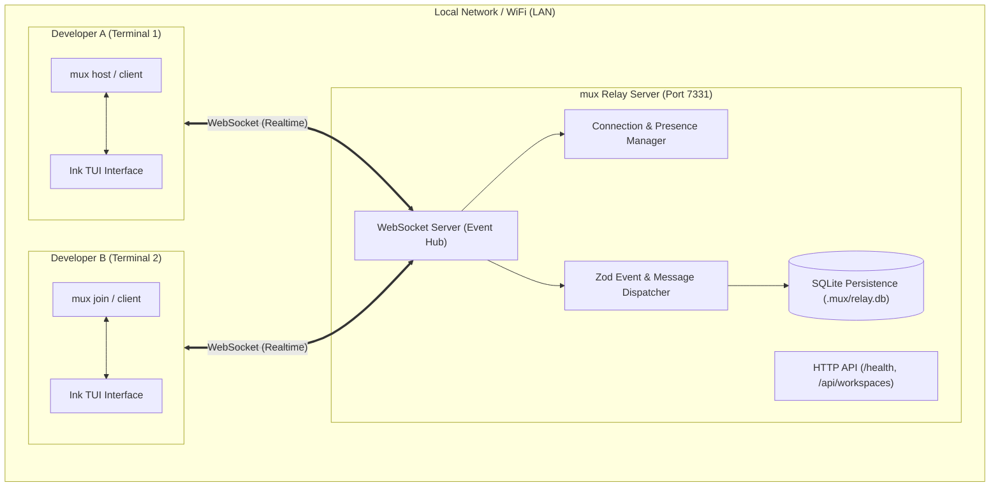

<div align="center">

```text
  ███╗   ███╗██╗   ██╗██╗  ██╗
  ████╗ ████║██║   ██║╚██╗██╔╝
  ██╔████╔██║██║   ██║ ╚███╔╝ 
  ██║╚██╔╝██║██║   ██║ ██╔██╗ 
  ██║ ╚═╝ ██║╚██████╔╝██╔╝ ██╗
  ╚═╝     ╚═╝ ╚═════╝ ╚═╝  ╚═╝
```

### The Multiplayer Terminal for Humans & AI Coding Agents

[](LICENSE)
[](https://www.typescriptlang.org/)
[](https://nodejs.org/)
[](https://vitest.dev/)
[](https://saweria.co/svaranova)
[](#installation)

<p align="center">
  <b>A real-time collaborative workspace where multiple software engineers and autonomous AI agents pair-program on the same codebase over local WiFi/LAN.</b>
</p>

---

[Key Concepts](#-key-concepts) •
[Visual Interface](#-visual-interface) •
[Architecture](#-architecture) •
[Multi-Agent](#-multi-agent-coordination-agy-codex-claude) •
[Installation (All OS)](#-installation-guide) •
[Quickstart](#-quickstart-guide) •
[Support](#-support--sponsorship) •
[Roadmap](#-mvp-roadmap)

---

</div>

## 💡 The Problem & The Vision

### Traditional Development
```text
Developer ──(prompt)──▶ AI Agent (Codex / agy / Claude) ──▶ Code in Isolation
```
Modern AI coding assistants are extraordinarily capable, but they operate as **isolated solo silos**. When multiple engineers collaborate on a sprint, each developer prompts their own agent separately. Context is lost, file edits collide, and handoffs happen through messy chat pastebins.

### The `mux` Paradigm
```text
Developer A ──▶ AI Agent A ──┐
                             ├──▶ [ mux Local Relay (LAN) ] ──▶ Git / GitHub
Developer B ──▶ AI Agent B ──┘           (WebSocket + SQLite)
```

`mux` turns any local repository into a **multiplayer terminal studio**:
- **Zero Cloud Lock-in**: Coordinates directly over your office or home WiFi/LAN.
- **Git is the Source of Truth**: Code lives in Git branches and commits; `mux` coordinates the collaboration layer.
- **Shared Team Awareness**: Realtime visibility of who is online, which AI agents are working, active tasks, and shared events.
- **Keyboard-First Experience**: Fully native terminal user interface (TUI) powered by React & Ink.

---

## 🖥 Visual Interface

```text
┌── PROJECT: MUX ────────────────────────── [CODE: MUX-84KM] ────── main ▾ ───┐
│                                                                             │
│  TEAM (3)               ACTIVITY & MESSAGES                                 │
│                                                                             │
│  ● yoga (you)           [15:41:02] ● yoga started the workspace             │
│  ● fajar                [15:41:18] ● fajar joined the workspace             │
│  ○ rizky (offline)      [15:41:30] <fajar>: Auth endpoints are deployed!    │
│                         [15:42:05] [DM] <yoga> → <fajar>: checking tests    │
│                         [15:42:19] [SYS] Task AUTH-01 claimed by fajar      │
│                                                                             │
├─────────────────────────────────────────────────────────────────────────────┤
│  > /msg @fajar Ready to review the login controller █                       │
└─────────────────────────────────────────────────────────────────────────────┘
```

---

## 🏗 Architecture



---

## 📦 Monorepo Layout

`mux` is engineered as a clean, modular TypeScript monorepo managed with `pnpm`:

```text
mux/
├── apps/
│   ├── cli/             # Interactive Ink TUI and CLI commands (mux host, mux join, mux relay)
│   └── relay/           # Local collaboration server (HTTP + WebSocket + SQLite engine)
├── packages/
│   ├── protocol/        # Shared Zod validation schemas, event envelopes, and contracts
│   └── database/        # SQLite tables, WAL mode connection, and repository implementations
├── docs/                # Comprehensive architectural and protocol documentation
├── tests/               # Vitest automated test suite (unit + real multi-client integration)
├── pnpm-workspace.yaml  # Workspace definitions
├── tsconfig.base.json   # Strict TypeScript base configuration
└── package.json         # Workspace root scripts
```

---

## 🚀 Installation Guide

`mux` requires **Node.js 20+** and **pnpm** (or npm).

### 🍎 macOS

#### Method 1: Using Global Symlink (Recommended)
```bash
# 1. Clone the repository
git clone https://github.com/SvaraNova/mux.git
cd mux

# 2. Install dependencies & build
pnpm install
pnpm build

# 3. Symlink globally to your user bin
ln -sf "$(pwd)/apps/cli/dist/bin/mux.js" ~/.local/bin/mux

# 4. Verify installation
mux --help
```
*(Ensure `~/.local/bin` is in your `$PATH` inside `~/.zshrc`)*.

---

### 🐧 Linux (Ubuntu / Debian / Arch / Fedora)

```bash
# 1. Clone repository
git clone https://github.com/SvaraNova/mux.git
cd mux

# 2. Install dependencies & build
pnpm install
pnpm build

# 3. Create global symlink
mkdir -p ~/.local/bin
ln -sf "$(pwd)/apps/cli/dist/bin/mux.js" ~/.local/bin/mux

# 4. Add to PATH if needed
echo 'export PATH="$HOME/.local/bin:$PATH"' >> ~/.bashrc
source ~/.bashrc

# 5. Verify installation
mux --help
```

---

### 🪟 Windows (PowerShell)

```powershell
# 1. Clone repository
git clone https://github.com/SvaraNova/mux.git
cd mux

# 2. Install dependencies & build
pnpm install
pnpm build

# 3. Run directly with node or tsx
pnpm mux --help

# Optional: Add to user profile alias
Set-Alias -Name mux -Value "$((Get-Location).Path)\apps\cli\dist\bin\mux.js"
```

---

## ⚡ Quickstart Guide

### 1. Host a Workspace (Terminal 1)
To start the collaboration server and open the interactive TUI:
```bash
mux host --project my-project --user Alice --agent agy
```
* Generates a unique room Join Code (e.g. `MY-P-4B9A`).
* Starts the WebSocket relay server on `ws://0.0.0.0:7331`.
* Sets the default active agent provider (`agy`, `codex`, or `claude`).
* Stores event logs in `my-project/.mux/relay.db`.

### 2. Teammate Joins (Terminal 2 / Another Machine on LAN)
In another terminal or another computer connected to the same WiFi:
```bash
mux join ws://localhost:7331 --project my-project --user Bob --agent claude
```
*(On another machine, replace `localhost` with the host machine's LAN IP, e.g., `ws://192.168.1.50:7331`)*.

### 3. Standalone Relay Mode
If you prefer running the relay headless in the background (e.g. on a shared local server/Raspberry Pi):
```bash
mux relay --port 7331
```
Check health:
```bash
curl http://localhost:7331/health
# {"status":"ok","version":"0.1.0","timestamp":"..."}
```

---

## 🤖 Multi-Agent Coordination (`agy`, `codex`, `claude`)

`mux` natively supports multiple AI coding agents within the same collaborative workspace:

* **Antigravity CLI (`agy`)**: Google's autonomous agentic coding assistant.
* **OpenAI Codex (`codex`)**: Codex CLI execution adapter.
* **Claude Code (`claude`)**: Anthropic's Claude Code CLI.

### Prompt Routing & Targeting

| Action | Syntax | Example |
| :--- | :--- | :--- |
| **Active Agent** | `> <instruction>` | `> inspect packages/database and run migrations` |
| **Target Claude** | `> @claude <instruction>` | `> @claude refactor auth module with async/await` |
| **Target Codex** | `> @codex <instruction>` | `> @codex generate comprehensive unit tests` |
| **Target Agy** | `> @agy <instruction>` | `> @agy analyze system performance and bottlenecks` |
| **Switch Active Agent** | `/agent use <provider>` | `/agent use claude` |
| **List Available Agents** | `/agent list` or `/agents` | `/agent list` |

---

## 🪟 Split-Pane Terminal Multiplexing (`mux split`)

Want a **terminal-inside-terminal** experience where you work directly in your full-featured native AI agent while seeing your team's live activity side-by-side?

Run `mux` in **split-pane mode**:
```bash
# Host a workspace with split pane (Left: agy interactive agent, Right: mux TUI)
mux host --split --user Alice --agent agy

# Or launch split mode directly
mux split --agent claude

# Join a teammate's workspace with split panes
mux join ws://192.168.1.50:7331 --split --user Bob --agent claude
```

* **Zero Compromises on Agent Features**: The agent pane is a **100% real interactive TTY**. You get full ANSI colors, cursor movements, real interactive prompts, tool approval confirmation (`Y/n`), and diff views.
* **Powered by tmux**: When `tmux` is available, `mux` automatically creates a dual-pane session with mouse scrolling enabled and easy pane switching (`Ctrl+b` + arrow keys).
* **Native Fallback**: On macOS without `tmux`, it seamlessly launches a companion terminal window side-by-side.

---

## 🔌 Team MCP Server (`mux mcp`)

How do AI agents running on different laptops talk directly to each other? Through the **Model Context Protocol (MCP)**!

`mux` acts as a LAN-wide Team MCP Server over standard I/O (JSON-RPC 2.0). Both **Antigravity (`agy`)** and **Claude Code (`claude`)** can discover and invoke collaborative tools directly.

### 1-Click Auto-Installation
```bash
mux mcp install
```
This registers `mux` into:
- Antigravity global configuration (`~/.gemini/config/mcp_config.json`)
- Claude Code global configuration (`~/.claude.json`)
- Project-level configuration (`.mcp.json`)

### Exposed MCP Tools for Agents
| Tool Name | What the AI Agent Does |
| :--- | :--- |
| `team_ask_agent` | **Ask a teammate's agent across the LAN** a question and await its response. |
| `team_reply_agent` | **Reply to inquiries** sent by other agents or developers in the workspace. |
| `team_send_message` | Post code snippets, reviews, or chat updates to `#general` or private DMs. |
| `team_broadcast_status`| Announce when starting or completing a task (`working` / `idle`). |
| `team_claim_task` | Lock a task and declare files being edited to **prevent merge conflicts**. |
| `team_get_context` | Query who is currently online, which agents are working, and recent team messages. |

---

## ⌨️ TUI Commands & Hotkeys

Inside the interactive terminal prompt:

| Command / Shortcut | Description | Example |
| :--- | :--- | :--- |
| `> <prompt>` | Launches the **real interactive agent terminal** with initial prompt | `> buat web app to do list` |
| `> @<provider> <prompt>` | Launches targeted real interactive terminal (`claude`, `codex`, `agy`) | `> @claude review pull request` |
| `<Ctrl+O>` or `/term` | Opens the real interactive agent shell directly | `<Ctrl+O>` |
| `<Tab>` | Cycles between active agents (`agy` ➔ `codex` ➔ `claude`) | `<Tab>` |
| `/agent use <provider>` | Switches default active agent provider | `/agent use claude` |
| `/agent list` | Shows all registered agents and local installation status | `/agent list` |
| `<text>` + `Enter` | Broadcasts a chat message to `#general` | `Hi everyone!` |
| `/msg @<user> <text>` | Sends a private direct message to a teammate | `/msg @Alice please check line 40` |
| `/clear` | Clears the local terminal event view | `/clear` |
| `/help` | Displays available in-terminal commands | `/help` |
| `/quit` or `Ctrl+C` | Gracefully disconnects and exits `mux` | `/quit` |

---

## 🧪 Verification & Testing

Every commit to `mux` is covered by strict typechecking and automated integration tests:

```bash
# Run strict TypeScript check across all packages
pnpm typecheck

# Run Vitest test suite (protocol schemas, SQLite, multi-agent, MCP, and multiplayer integration)
pnpm test
```

Test results:
```text
 ✓ tests/mcp.test.ts         (4 tests)
 ✓ tests/multiplayer.test.ts (2 tests)
 ✓ tests/multi_agent.test.ts (5 tests)
 ✓ tests/database.test.ts    (4 tests)
 ✓ tests/agent.test.ts       (2 tests)
 ✓ tests/protocol.test.ts    (5 tests)

Test Files  6 passed (6)
Tests       22 passed (22)
```

---

## 🗺 MVP Roadmap

- [x] **Phase 1 — Skeleton & Core Relay**: Monorepo, shared Zod protocol, SQLite persistence, WebSocket hub, interactive Ink TUI, multi-client test.
- [x] **Phase 2 — Multi-Agent Coordination**: Provider-agnostic `AgentAdapter`, `AgentRegistry`, `agy` / `codex` / `claude` support, prompt routing (`@agent`), and LAN presence.
- [ ] **Phase 3 — Realtime Channels & Audit Stream**: Dedicated channels (`#general`, `#backend`), `/events` audit stream.
- [ ] **Phase 4 — Task Coordination**: Task creation, claiming, progress states, and live broadcast.
- [ ] **Phase 5 — Git State Awareness**: Branch detection, commit notifications (`git.commit.created`), dirty state tracking.
- [x] **Phase 6 — Team MCP Tools**: Local Model Context Protocol server exposing `team.*` tool calls (`team_ask_agent`, `team_reply_agent`, etc.).
- [ ] **Phase 7 — Structured Handoff**: End-to-end task and branch handoff between agents.
- [ ] **Phase 8 — Soft File Reservations**: Warning signals when agents touch overlapping source files.
- [ ] **Phase 9 — mDNS LAN Discovery**: Zero-config network discovery (`mux discover`).

---

## ☕ Support & Sponsorship

If you find `mux` exciting and valuable for your multiplayer development workflow, consider supporting the project and author on **Saweria**:

<p align="center">
  <a href="https://saweria.co/svaranova" target="_blank">
    
  </a>
</p>

> 🧡 Setiap dukungan membantu keberlanjutan pengembangan fitur lanjutan `mux`, riset kolaborasi autonomous coding agents, dan pemeliharaan proyek open source ini.
>
> 🔗 **Donasi / Dukung via Saweria**: [https://saweria.co/svaranova](https://saweria.co/svaranova)

---

## 📄 License

This project is licensed under the [MIT License](LICENSE).
